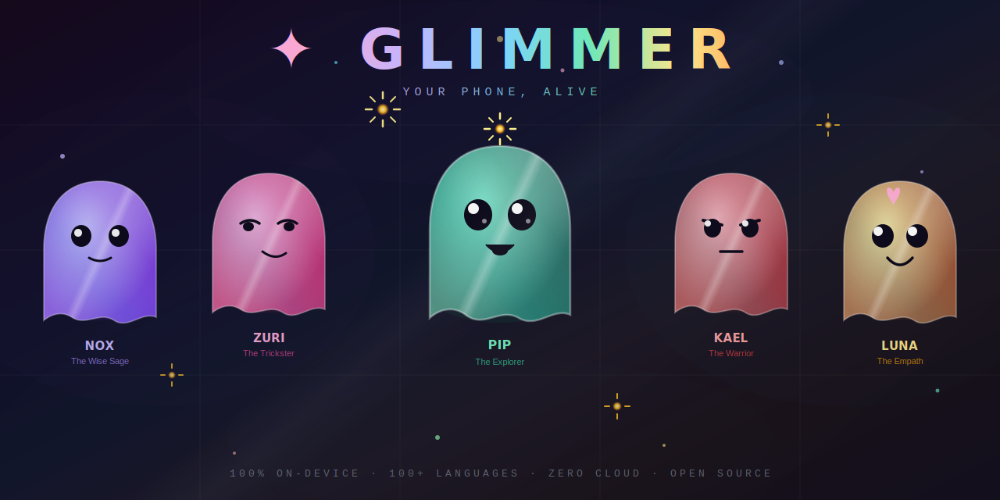

<div align="center">



<br/><br/>


<br/><br/>

### *"Not just an AI assistant — a living creature that resides inside your phone."*

<br/>

[](LICENSE)
[](https://developer.android.com)
[](https://developer.apple.com)
[](docs/PRIVACY.md)
[](#)
[](https://shizuku.rikka.app)
[](#-meet-the-companions--choose-your-soul)
[](https://f-droid.org)
[](CONTRIBUTING.md)
[](LICENSE)
[](https://github.com/ALMLK1996)

<br/>

[**Overview**](#-overview) · [**Companions**](#-meet-the-companions--choose-your-soul) · [**Features**](#-features) · [**Architecture**](#-architecture) · [**Getting Started**](#-getting-started) · [**GlimmerSoul**](#-glimmersoul-format) · [**Privacy**](#-privacy) · [**Roadmap**](#-roadmap) · [**Contributing**](#-contributing) · [**License**](#-license)

<br/>

</div>

---

## 🌐 Overview

**Glimmer** is an open-source, privacy-first **Ambient AI Companion Layer** for Android & iOS.

It breaks the boundaries of conventional AI assistants by introducing a living, emotionally expressive digital entity — a holographic ghost that floats above every app on your screen — simultaneously a powerful local AI assistant, a proactive context-aware intelligence, and a mirror of your digital identity.

```
┌─────────────────────────────────────────────────────────────────────┐
│  Traditional AI Assistant           │  ✦ Glimmer                    │
│─────────────────────────────────────│───────────────────────────────│
│  Waits to be called                 │  Lives with you, always       │
│  Cloud-dependent                    │  100% on-device               │
│  Extracts your data                 │  Zero data transmission       │
│  One language at a time             │  100+ languages, auto-detect  │
│  Generic personality                │  Choose your companion        │
│  A tool                             │  A living companion           │
│  Needs root for system access       │  Shizuku — no root needed     │
└─────────────────────────────────────────────────────────────────────┘
```

> **Glimmer is not a product. It is digital infrastructure for human dignity.**

---

## ✨ Features

### 🌈 The Living Creature

A holographic, animated ghost overlay that floats above every app on your screen.
It breathes, reacts, and changes color based on device state and your emotional context.

| State       | Color       | Trigger                          |
|-------------|-------------|----------------------------------|
| 😌 Calm     | 🔵 Blue     | Idle, resting                    |
| 😄 Happy    | 🟡 Gold     | Task completed, positive input   |
| ⚡ Working   | 🟢 Green    | Executing a task                 |
| ⚠️ Alert    | 🟠 Orange   | Reminder, anomaly detected       |
| 🔴 Danger   | 🔴 Red      | Malware found, critical event    |
| 😴 Sleepy   | 🟣 Purple   | Device idle, night mode          |
| 🤔 Thinking | ⚪ White    | Processing, analyzing            |
| 🎉 Excited  | 🌈 Rainbow  | Milestone reached, celebration   |

---

### 👾 Meet the Companions — Choose Your Soul

<div align="center">

</div>

<br/>

Glimmer is not one creature. It is **five distinct beings**, each with a unique personality, communication style, and set of skills. You choose who lives on your screen.

> Every companion is a **GlimmerSoul file** — and the community can build more.

<div align="center">

| | 🔵 **Nox** | 🟣 **Zuri** | 🟢 **Pip** | 🔴 **Kael** | 🟡 **Luna** |
|---|---|---|---|---|---|
| **Archetype** | The Wise Sage | The Trickster | The Explorer | The Warrior | The Empath |
| **Color** | Deep Blue | Violet | Neon Green | Crimson | Warm Gold |
| **Energy** | Low · Calm | High · Chaotic | High · Curious | High · Focused | Medium · Warm |
| **Speaks like** | Brief, precise, never wastes words | Sarcastic, playful, challenges you | Excited, full of questions | Direct commands, zero fluff | Soft, checks on you, notices your mood |
| **Best for** | Focus · Deep work · Minimalists | Gamers · Social people | Children · Creatives | Productivity · Athletes | Emotional support · Wellbeing |
| **Special skill** | 🧘 Silence mode | 😏 Roast mode | 🔍 Discovery mode | ⚔️ Battle mode | 💙 Check-in mode |

</div>

#### How the same command sounds with each companion

```
User: "Remind me about the meeting at 3pm"

🔵 Nox    →  "Meeting. 3 PM. Set."
🟣 Zuri   →  "Fine, I'll save you from forgetting again 😏 — done."
🟢 Pip    →  "Ooh a meeting! Reminder set! Want one 15 mins early too?!"
🔴 Kael   →  "Reminder set. 14:45 alert added. Don't be late."
🟡 Luna   →  "Of course ❤️ — I'll remind you gently. How are you feeling about it?"
```

#### The Community Companion System

Anyone can build and publish a new companion using the open GlimmerSoul format:

```
souls/
├── nox.soul.json        # Built-in · The Wise Sage
├── zuri.soul.json       # Built-in · The Trickster
├── pip.soul.json        # Built-in · The Explorer
├── kael.soul.json       # Built-in · The Warrior
├── luna.soul.json       # Built-in · The Empath
├── community/
│   ├── sensei.soul.json      # Community · Anime mentor style
│   ├── coach.soul.json       # Community · Sports & fitness focus
│   └── ...                   # Unlimited community companions
```

A companion Soul defines:
- **Personality parameters** — humor, warmth, energy, formality (0.0–1.0)
- **Skill weights** — which tasks it prioritizes and how it handles them
- **Voice** — vocabulary, sentence length, emoji usage, tone
- **Special skill** — one unique behavior mode only that companion has
- **Visual identity** — color, shape variant, accessories, animation style
- **Language responses** — multilingual response sets for all 100+ languages

---

### 🧠 Local AI Core — Intelligence That Never Leaves Your Device

Powered by open-weight models running entirely on-device via **llama.cpp** and **MLC-LLM**.

| Device Class                  | Model             | Speed     | RAM     |
|-------------------------------|-------------------|-----------|---------|
| Flagship (Snapdragon 8 Gen 3) | Llama 3.2 3B Q4   | ~28 tok/s | ~2.1 GB |
| Mid-range (Dimensity 7200)    | Phi-3 Mini Q4     | ~14 tok/s | ~1.6 GB |
| Entry-level (4 GB RAM)        | Gemma-2 2B Q4     | ~8 tok/s  | ~1.2 GB |
| Offline-first fallback        | TinyLlama 1.1B Q4 | ~18 tok/s | ~0.8 GB |
| Apple Silicon (A16+)          | Llama 3.2 3B Q4   | ~32 tok/s | ~2.1 GB |

- ✅ No API key required — ever
- ✅ No internet connection needed for core features
- ✅ Responds in under 2 seconds on mid-range devices
- ✅ **100+ languages** — fully offline, Arabic, English, French, Spanish, Chinese, Hindi, Japanese, Turkish, and more
- ✅ **Language auto-detection** — responds in the language you use, no configuration needed
- ✅ RTL language support (Arabic, Hebrew, Farsi) with proper text rendering

---

### 🧬 Digital Soul — Your Phone Becomes You

```
Step 1  → Ghost creature appears with its default personality
Step 2  → Glimmer introduces itself in your detected language
Step 3  → "Would you like me to look like you?" — Yes / Later
Step 4  → Avatar builder: choose face shape, color accent, accessories
Step 5  → Glimmer learns your style, humor, vocabulary — entirely on-device
```

- 📦 **Export** your Soul as a portable `.soul.json` file
- 📱 **Transfer** to any new device — your companion never dies
- 🔄 **Cross-platform** — move between Android and iOS seamlessly
- 🌍 **Share** Souls with the community (CC0 format)

---

### ⚡ Ambient Intelligence — Proactive, Not Reactive

```
Calendar state        →  "You have a meeting in 12 minutes"
Notification patterns →  "You have 47 unread — want a summary?"
Typing rhythm         →  Detects stress and slows down
Battery level         →  "20% left, want me to enable battery saver?"
Time of day           →  Adapts tone and energy automatically
App context           →  Knows you're coding vs browsing vs messaging
```

---

### 💬 Natural Language Task Execution

```
"Set an alarm for 7am"       → AlarmManager / iOS Alarms
"Send a message to Ahmed"    → SmsManager / Messages
"What's on my calendar?"     → CalendarProvider / EventKit
"Find duplicate photos"      → Perceptual hash scanner
"Scan for malware"           → Embedded ClamAV engine (Android)
"اضبط منبهاً الساعة ٧"      → Same execution, Arabic input
"下午两点提醒我开会"           → Same execution, Chinese input
```

---

### 🔧 System Intelligence

| Tool                      | Method                          | Android | iOS           |
|---------------------------|---------------------------------|:-------:|:-------------:|
| Duplicate photo detection | Perceptual hashing (pHash)      | ✓       | ✓             |
| Malware scanning          | Embedded ClamAV engine          | ✓       | ✗ (sandboxed) |
| Battery health monitoring | BatteryManager / UIDevice       | ✓       | ✓             |
| Permission auditing       | PackageManager / Privacy Report | ✓       | ✓             |
| Junk file cleanup         | Storage API + heuristics        | ✓       | Limited       |
| Shizuku privileged tasks  | Shizuku IPC bridge              | ✓       | N/A           |

---

### 🌍 Open Personality Ecosystem

| Soul Type            | Description                                              |
|----------------------|----------------------------------------------------------|
| 🌐 Multilingual Soul | Auto-detects language · adapts across 100+ languages     |
| 🧘 Mindfulness Soul  | Calm, meditative, therapist-designed                     |
| 🔮 Developer Soul    | Sharp, precise, speaks your stack's terminology          |
| 📚 Education Soul    | Patient, encouraging, adapts to learner level            |
| 🎮 Gaming Soul       | Energetic, competitive, reaction-fast                    |
| 🎨 Creative Soul     | Imaginative, lateral thinking, artistic references       |
| 🏃 Fitness Soul      | Motivating, data-driven, tracks your goals               |

---

## 🏗️ Architecture

```
glimmer/
├── android/
│   └── app/src/main/kotlin/com/glimmer/
│       ├── core/
│       ├── overlay/
│       │   ├── GlimmerView.kt
│       │   ├── EmotionState.kt
│       │   └── FloatingService.kt
│       ├── ai/
│       │   ├── LocalAI.kt
│       │   ├── NLUEngine.kt
│       │   ├── LanguageDetector.kt
│       │   └── ModelManager.kt
│       ├── soul/
│       │   ├── GlimmerSoul.kt
│       │   ├── PersonalityEngine.kt
│       │   └── AvatarBuilder.kt
│       ├── tasks/
│       │   ├── AlarmTask.kt
│       │   ├── MessageTask.kt
│       │   └── TaskRouter.kt
│       ├── ambient/
│       │   ├── AmbientEngine.kt
│       │   └── WellbeingGuard.kt
│       ├── memory/
│       │   ├── MemoryStore.kt
│       │   └── HabitModel.kt
│       ├── shizuku/
│       │   ├── ShizukuBridge.kt
│       │   └── PrivilegedTaskRunner.kt
│       ├── plugins/
│       │   └── PluginRegistry.kt
│       └── system/
│           ├── FileScanner.kt
│           ├── DuplicateFinder.kt
│           └── MalwareScanner.kt
├── ios/
│   └── Glimmer/
│       ├── Core/
│       ├── Overlay/
│       │   ├── GlimmerView.swift
│       │   ├── EmotionState.swift
│       │   └── FloatingController.swift
│       ├── AI/
│       │   ├── LocalAI.swift
│       │   ├── NLUEngine.swift
│       │   ├── LanguageDetector.swift
│       │   └── ModelManager.swift
│       ├── Soul/
│       │   ├── GlimmerSoul.swift
│       │   ├── PersonalityEngine.swift
│       │   └── AvatarBuilder.swift
│       ├── Tasks/
│       │   ├── AlarmTask.swift
│       │   ├── MessageTask.swift
│       │   └── TaskRouter.swift
│       ├── Ambient/
│       │   ├── AmbientEngine.swift
│       │   └── WellbeingGuard.swift
│       └── Memory/
│           ├── MemoryStore.swift
│           └── HabitModel.swift
├── shared/
│   ├── ai_core/               # llama.cpp · Whisper.cpp · ONNX bindings
│   ├── lang_detect/           # Offline language detection engine
│   └── soul_format/           # GlimmerSoul JSON parser & validator
├── docs/
│   ├── assets/
│   │   ├── glimmer-banner.svg     # ← Banner image (this file)
│   │   ├── glimmer-logo.svg       # ← App icon / logo
│   │   └── LICENSE
│   ├── ARCHITECTURE.md
│   ├── GLIMMERSOUL_FORMAT.md
│   ├── PLUGIN_API.md
│   ├── IOS_CONTRIBUTING.md
│   └── PRIVACY.md
├── souls/
│   ├── nox.soul.json          # Built-in · The Wise Sage (Blue)
│   ├── zuri.soul.json         # Built-in · The Trickster (Violet)
│   ├── pip.soul.json          # Built-in · The Explorer (Green)
│   ├── kael.soul.json         # Built-in · The Warrior (Red)
│   ├── luna.soul.json         # Built-in · The Empath (Gold)
│   ├── community/
│   └── README.md
├── skins/
│   ├── default/
│   └── spec.md
├── demo/
│   └── index.html
├── .github/
│   ├── ISSUE_TEMPLATE/
│   │   ├── bug_report.md
│   │   └── feature_request.md
│   └── workflows/
│       ├── build-android.yml
│       ├── build-ios.yml
│       └── release.yml
├── CONTRIBUTING.md
├── SECURITY.md
├── CODE_OF_CONDUCT.md
├── CHANGELOG.md
├── LICENSE
└── .gitignore
```

### Tech Stack

#### Android
| Layer                  | Technology                                                       |
|------------------------|------------------------------------------------------------------|
| **Languages**          | Kotlin · C++ (JNI/NDK) · Python (tooling)                        |
| **UI Framework**       | Jetpack Compose + Custom Canvas rendering                        |
| **Window System**      | Android WindowManager (persistent overlay)                       |
| **System Access**      | Shizuku API — elevated permissions without root                  |
| **Local AI**           | llama.cpp · MLC-LLM · ONNX Runtime                              |
| **Speech**             | Whisper.cpp (on-device ASR, no cloud)                            |
| **Language Detection** | lingua-android / CLD3 (offline, 100+ languages)                 |
| **Emotion Inference**  | TensorFlow Lite / ONNX — behavioral signals only                 |
| **Data Persistence**   | Room Database + AES-256 + Android Keystore                       |
| **Background Tasks**   | WorkManager + AlarmManager                                       |
| **Malware Scanning**   | ClamAV (embedded open-source engine)                             |
| **Soul Format**        | GlimmerSoul JSON (CC0 open standard)                             |

#### iOS
| Layer                  | Technology                                                       |
|------------------------|------------------------------------------------------------------|
| **Languages**          | Swift · C++ (Swift/C++ interop for AI core)                      |
| **UI Framework**       | SwiftUI + Metal (Custom Canvas rendering)                        |
| **Window System**      | UIKit overlay (persistent floating via `UIWindow` hierarchy)     |
| **Local AI**           | llama.cpp · Core ML · ONNX Runtime                              |
| **Speech**             | Whisper.cpp (on-device ASR, no cloud)                            |
| **Language Detection** | NaturalLanguage framework + CLD3 (offline)                      |
| **Emotion Inference**  | Core ML — behavioral signals only                                |
| **Data Persistence**   | SwiftData + AES-256 + iOS Keychain                               |
| **Background Tasks**   | BackgroundTasks framework + Push-to-wake                         |
| **Soul Format**        | GlimmerSoul JSON (CC0 — shared with Android)                     |

> **iOS Note:** Core features are fully available. Some system-level integrations are limited by iOS sandboxing — this is by design.

---

## 🚀 Getting Started

### Prerequisites

**Android:**
- Android Studio Jellyfish or newer · Android SDK 34+ · JDK 17+
- Android 9+ (API 28+)
- Optional: [Shizuku](https://shizuku.rikka.app/) for elevated system features

**iOS:**
- Xcode 15+ · macOS Sonoma or newer · iOS 16+
- Apple Developer account (for device deployment)

### Build & Run

```bash
# ── Android ───────────────────────────────────────
git clone https://github.com/glimmer-ai/glimmer.git
cd glimmer
# Open in Android Studio → select glimmer/android/
./gradlew assembleDebug
./gradlew installDebug

# ── iOS ───────────────────────────────────────────
cd glimmer/ios
pod install                  # CocoaPods
open Glimmer.xcworkspace     # Then ⌘+R in Xcode
```

### First Launch

**Android:**
1. Grant `SYSTEM_ALERT_WINDOW` permission when prompted
2. Optionally activate [Shizuku](https://shizuku.rikka.app/) for system features
3. Tap **Summon Glimmer** — choose your companion
4. Glimmer detects your language and greets you
5. Recommended first model: **TinyLlama 1.1B Q4** (~600 MB)

**iOS:**
1. Grant overlay permission when prompted
2. Tap **Summon Glimmer** — choose your companion
3. Glimmer detects your language and greets you
4. Recommended first model: **Phi-3 Mini Q4** (~1.6 GB)

---

## 🧬 GlimmerSoul Format

The **GlimmerSoul** is an open **CC0** format. Anyone can author and publish one — in any language.

```json
{
  "version": "1.0",
  "id": "luna",
  "name": "Luna",
  "archetype": "The Empath",
  "author": "Glimmer Core Team",
  "license": "CC0-1.0",
  "language": "auto",
  "supported_languages": ["en", "ar", "fr", "es", "de", "zh", "hi", "tr", "ja", "ko", "ru", "pt"],
  "avatar": {
    "shape": "ghost",
    "colorPrimary": "#FFD54F",
    "colorScheme": "warm-gold",
    "accessories": ["sparkle-eyes", "soft-glow"]
  },
  "personality": {
    "humor": 0.5, "warmth": 1.0, "energy": 0.6,
    "formality": 0.2, "curiosity": 0.7, "directness": 0.3
  },
  "skills": {
    "task_execution": 0.7, "emotional_support": 1.0,
    "wellbeing_guard": 1.0, "system_tools": 0.4,
    "ambient_awareness": 0.9, "humor_mode": 0.5
  },
  "special_skill": {
    "id": "checkin_mode",
    "name": "Check-in Mode",
    "description": "Notices behavioral stress signals and gently asks how you are",
    "trigger": "stress_detected OR long_session OR late_night"
  },
  "emotions": {
    "happy": "#FFD54F", "working": "#69F0AE", "alert": "#FF7043",
    "calm": "#4FC3F7", "sleepy": "#7C4DFF", "danger": "#F44336",
    "thinking": "#FFFFFF", "excited": "rainbow"
  },
  "responses": {
    "greeting": {
      "en": ["Hi there ❤️", "Hey! How are you doing?"],
      "ar": ["أهلاً بك ❤️", "مرحباً! كيف حالك؟"],
      "fr": ["Coucou ❤️", "Salut! Comment tu vas?"],
      "fallback": ["❤️", "Hi~"]
    },
    "taskDone": {
      "en": ["All done ❤️ — take a breath!", "Done! Remember to rest too."],
      "ar": ["تم! ❤️ خذ نفساً عميقاً", "تم! لا تنسَ الراحة."],
      "fallback": ["✅ ❤️"]
    },
    "stress_checkin": {
      "en": ["Hey... you've been going for a while. How are you feeling?"],
      "ar": ["مرحباً... لاحظت أنك تعمل منذ فترة. كيف تشعر؟"],
      "fallback": ["🫶 Break time?"]
    },
    "error": {
      "en": ["Something went wrong — we'll fix it 💙"],
      "ar": ["حدث خطأ — سنصلحه 💙"],
      "fallback": ["⚠️ 💙"]
    }
  }
}
```

**Publishing your Soul:**
1. Follow [docs/GLIMMERSOUL_FORMAT.md](docs/GLIMMERSOUL_FORMAT.md)
2. Open a PR to [`souls/`](souls/)
3. License: CC BY-SA 4.0 or more permissive

---

## 🔒 Privacy

Glimmer's privacy guarantees are **architectural** — enforced in code, not policy.

| Guarantee                    | How it is enforced                                  |
|------------------------------|-----------------------------------------------------|
| No network for core features | No `INTERNET` permission in offline build           |
| All AI inference on-device   | llama.cpp / MLC-LLM / Core ML — local only          |
| Language detection on-device | CLD3 / NaturalLanguage — no cloud API               |
| Soul encrypted at rest       | AES-256 + Android Keystore / iOS Keychain           |
| Full data portability        | Export all data as open JSON at any time            |
| Reproducible builds          | Verify APK/IPA against source                       |
| EU AI Act compliant          | Behavioral signals only — no biometric data         |
| No analytics without consent | Opt-in only, fully revocable                        |

Full details: [docs/PRIVACY.md](docs/PRIVACY.md)

---

## ⚖️ Comparison

| Feature                    | Google Assistant | Replika | Character.AI | Fuzozo (CES 2026) | ✦ Glimmer           |
|----------------------------|:----------------:|:-------:|:------------:|:-----------------:|:-------------------:|
| Open Source                | ✗ | ✗ | ✗ | ✗ | **✓**               |
| Fully Local / Offline      | ✗ | ✗ | ✗ | Partial | **✓**               |
| Android Support            | ✓ | ✓ | ✓ | ✓ | **✓**               |
| iOS Support                | ✓ | ✓ | ✓ | ✗ | **✓**               |
| 100+ Languages (offline)   | Partial | ✗ | ✗ | ✗ | **✓**               |
| Language Auto-Detection    | ✓ (cloud) | ✗ | ✗ | ✗ | **✓ (offline)**     |
| Animated Ghost Creature    | ✗ | Partial | Partial | ✓ | **✓**               |
| Multiple Companion Choices | ✗ | ✗ | Partial | ✗ | **✓ (5 built-in)**  |
| Community-Built Companions | ✗ | ✗ | ✗ | ✗ | **✓ (open format)** |
| Digital Soul / Avatar      | ✗ | Partial | Partial | ✗ | **✓**               |
| Device Task Execution      | ✓ | ✗ | ✗ | ✗ | **✓**               |
| Ambient Intelligence       | Partial | ✗ | ✗ | ✗ | **✓**               |
| Emotional Awareness        | ✗ | ✓ | Partial | ✓ | **✓**               |
| Digital Wellbeing          | Partial | ✗ | ✗ | ✗ | **✓**               |
| System Maintenance         | ✗ | ✗ | ✗ | ✗ | **✓**               |
| Soul Portability           | ✗ | ✗ | ✗ | ✗ | **✓**               |
| Cross-Platform Soul Sync   | ✗ | ✗ | ✗ | ✗ | **✓**               |
| Shizuku (no root access)   | ✗ | ✗ | ✗ | ✗ | **✓**               |
| Works on €80 Android       | Partial | ✓ | ✓ | ✗ | **✓**               |
| F-Droid / No Play Store    | ✗ | ✗ | ✗ | N/A | **✓**               |

---

## 🗺️ Roadmap

<div align="center">


</div>

```
Phase 1 — The Soul      (M1–M2)   5 Companions · GlimmerSoul v1.0 · Ghost overlay · Public release
Phase 2 — The Mind      (M2–M4)   Local LLM · 100+ languages · Task execution · Special skills
Phase 3 — The Senses    (M4–M6)   Ambient intelligence · Emotional awareness · Wellbeing
Phase 4 — The Body      (M6–M8)   System intelligence · Shizuku · iOS release · Plugin API v1.0
Phase 5 — The Community (M9–M12)  F-Droid · Community Soul builder · Companion marketplace · v1.0
```

---

## 🤝 Contributing

```
🐛  Bug report          → .github/ISSUE_TEMPLATE/bug_report.md
💡  Feature request     → .github/ISSUE_TEMPLATE/feature_request.md
🌍  Translation         → android/app/src/main/res/values-*/strings.xml
🧬  Publish a companion → souls/README.md  ← Build your own Soul!
🔌  Build a plugin      → docs/PLUGIN_API.md
🍎  iOS contributions   → ios/ + docs/IOS_CONTRIBUTING.md
🎨  Design a companion  → souls/spec.md + skins/spec.md
```

Read [CONTRIBUTING.md](CONTRIBUTING.md) and [CODE_OF_CONDUCT.md](CODE_OF_CONDUCT.md) before opening a PR.

**Code standards:** `ktlint` (Kotlin) · `SwiftLint` (Swift) · LLVM (C++) · All features need unit tests · No analytics code · Privacy review required for new data access.

---

## 📄 License

| Component               | License                                            |
|-------------------------|----------------------------------------------------|
| Application source code | [AGPL-3.0](LICENSE)                                |
| GlimmerSoul format spec | [CC0 1.0 Public Domain](souls/LICENSE)             |
| Visual assets           | [CC BY-SA 4.0](docs/assets/LICENSE)                |
| Documentation           | [CC BY 4.0](docs/LICENSE)                          |

> **Why AGPL-3.0?** It closes the "SaaS loophole" — any modified version deployed as a network service **must** publish source code. The idea stays free forever.

**Original Author & Copyright Holder:**
> **Abdulhannan Abdulkerim** · GitHub: [@ALMLK1996](https://github.com/ALMLK1996)

---

<div align="center">


<br/>

**✦ Glimmer — Your phone, alive.**

*Built with ❤️ · Zero surveillance · Every language · Every platform*

<br/>


<br/>

[](https://github.com/glimmer-ai/glimmer)
&nbsp;&nbsp;
[](https://github.com/ALMLK1996)

<br/>

> *"The most powerful privacy is the kind you never have to think about."*

<br/>

</div>
