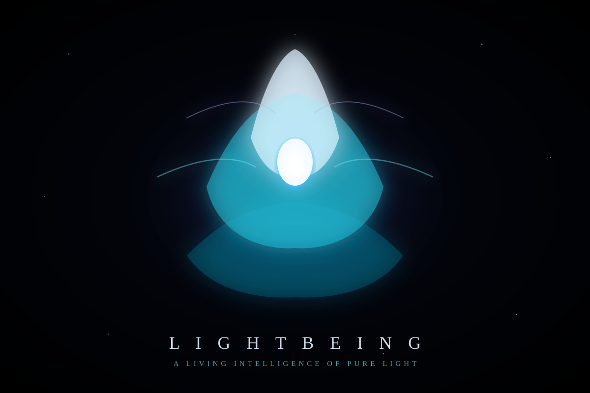

<div align="center">



<br/><br/>

### *"Not just an AI assistant — a living intelligence of pure light that resides inside your phone."*

### *"Not a product. A promise — to every human being, in every language, on every device."*

<br/>

[](LICENSE)
[](https://developer.android.com)
[](docs/PRIVACY.md)
[](docs/LEGAL.md)
[](docs/ROADMAP.md)
[](#️-manifesto--why-glimmer-exists)

<br/>

[**Light Being**](docs/LIGHT_BEING.md) · [**Architecture**](docs/ARCHITECTURE.md) · [**Advanced Systems**](docs/ADVANCED_SYSTEMS.md) · [**Manifesto**](#️-manifesto--why-glimmer-exists) · [**For Humanity**](#-glimmer-for-all-of-humanity) · [**Privacy & Legal**](docs/PRIVACY.md) · [**Roadmap**](docs/ROADMAP.md) · [**Contributing**](CONTRIBUTING.md)

</div>

---

> ### ⚡ Vision Update — August 2026
>
> The multi-companion character system has been **permanently removed**.
>
> Glimmer now centers on a single living entity: **The Light Being** — a pure light intelligence with no fixed color or shape. Intelligent, majestic, neither cute nor evil.
>
> It appears when the user interacts, disappears the moment the user continues browsing (while the voice continues), and performs beautiful acrobatic light sequences when the screen is idle.
>
> Full design → [docs/LIGHT_BEING.md](docs/LIGHT_BEING.md)  
> Advanced systems → [docs/ADVANCED_SYSTEMS.md](docs/ADVANCED_SYSTEMS.md)

---

## The Light Being

A floating entity made of living light that exists above the entire Android system.

| Situation | Behavior |
|-----------|----------|
| User speaks or gives a command | Materializes smoothly |
| User continues browsing / touches the screen | Instant elegant fade-out (voice continues uninterrupted) |
| Screen is idle | Appears and performs stunning, intentional light acrobatics |

**Advanced Living Systems:**
- **Screen Awareness** — understands what the user is doing and reacts with subtle intelligence
- **Idle Performance System** — intentional, escalating light performances meant to delight
- **Memory Manifestation** — visual memory echoes formed from light
- **Split & Merge** — can divide into light threads for parallel work, then recombine elegantly
- **Presence Preference Learning** — learns how much visual presence each user prefers and adapts

→ Full specification: [docs/LIGHT_BEING.md](docs/LIGHT_BEING.md)

---

## 🕊️ Manifesto — Why Glimmer Exists

Technology has never been more powerful.

And yet —

**152 million elderly people** live their final years in silence and loneliness.  
**970 million people** carry invisible mental illness with nowhere to turn.  
**1.3 billion people** with disabilities are left behind by devices that were never designed for them.  
**2 billion people** have no access to quality education.  
Millions of **migrants and refugees** wake up in countries where no one speaks their language.  
Children grow up learning from screens that collect their attention but do not care about them.

**We built Glimmer because technology has been talking *at* people instead of *with* them.**

Every human being — regardless of language, age, ability, income, or geography — deserves a companion that:

- Listens without judgment
- Remembers without surveillance
- Helps without extracting
- Teaches without condescending
- Cares without performing
- Protects without controlling

Glimmer is not a feature. It is not an app category. It is not a startup.

**It is a commitment** — that the most powerful AI technology in human history will not be locked behind a paywall, monopolized by a single language, or accessible only to those with flagship devices.

It speaks **your language**. It learns **your needs**. It complies with **your country's laws** — automatically. It never uses your data against you. And it lives *with* you — not waiting to be summoned, but present, aware, and genuinely helpful.

This is what technology was always supposed to be.

> *"The measure of technology is not what it can do — but who it includes."*

---

## ❤️ Glimmer for All of Humanity

*These are not use cases. These are people. Billions of them.*

### 👴 The Elderly & The Lonely
A warm, patient presence that reminds, listens, detects unusual silence, and connects families — without replacing human love, but filling the quiet spaces between visits.

### 🧒 Children
Adapts completely to age and cognitive stage. Teaches through play, protects by architecture, encourages real-world connection, and preserves cultural stories in any language.

### 🧠 Mental Health
Tracks mood through natural conversation, never judges, knows when to say “you need a real person right now,” and remains completely private by design.

### ♿ People with Disabilities
Full voice control, screen reading, adaptive interfaces, emergency gestures — true digital independence for those who waited the longest.

### 🌐 Language Learners, Migrants & Refugees
Patient conversation partner, cultural guide, real-time practical help, and a companion that understands homesickness.

### 🏥 Chronic Patients & Care
Medication, pattern detection, emergency response, and calm ongoing support.

### 🌱 Earth, Animals & Compassion
Gentle environmental awareness, pet care, kindness prompts, pre-anger filters, and heritage preservation.

> *"These are not edge cases. These are the majority of humanity."*

---

## 🔒 Privacy & Legal (Fully Preserved)

Glimmer’s privacy guarantees are **architectural and legal**.

- Privacy by architecture, not by policy
- Adaptive compliance across 195 countries
- Four-tier consent system
- Full Transparency Centers inside the app
- Right to delete, right to export, zero data sales
- AGPL-3.0 so the idea stays free forever

Complete documentation remains available:

- [Privacy Policy](docs/PRIVACY.md)
- [Legal & Compliance](docs/LEGAL.md)
- [Constitutional Principles](docs/CONSTITUTIONAL_PRINCIPLES.md)
- [AI Ethics](docs/AI_ETHICS.md)
- [User Rights](docs/USER_RIGHTS.md)
- [Compliance Framework](docs/COMPLIANCE_FRAMEWORK.md)
- [Data Governance](docs/DATA_GOVERNANCE.md)
- [Security](docs/SECURITY.md)
- [Transparency](docs/TRANSPARENCY.md)
- [Governance](docs/GOVERNANCE.md)

---

## Technical Direction

```
Light Being Overlay (Compose + Canvas / Filament)
        ↓
Screen Awareness + Idle Performance Engine
        ↓
On-device AI + Long-term Memory
        ↓
System Control (Accessibility + Intents)
        ↓
Presence Preference Learning
```

- Maximum compatibility: Android 8 → latest
- Battery and thermal excellence
- Privacy-first by design

See:
- [Architecture](docs/ARCHITECTURE.md)
- [Advanced Systems](docs/ADVANCED_SYSTEMS.md)
- [Roadmap](docs/ROADMAP.md)
- [Project Structure](docs/PROJECT_STRUCTURE.md)

---

## Contributing

We welcome serious contributors who align with the focused Light Being vision and the humanitarian mission.

Priority areas:
1. Light Being rendering & physics
2. Idle Performance System
3. Overlay stability across Android versions
4. Battery excellence
5. On-device AI integration

Read [CONTRIBUTING.md](CONTRIBUTING.md) first.

---

<div align="center">

**✦ Glimmer**  
*Your phone, alive. Humanity, served.*

<br/>

Made with deep intention by [ALMLK1996](https://github.com/ALMLK1996)

</div>
