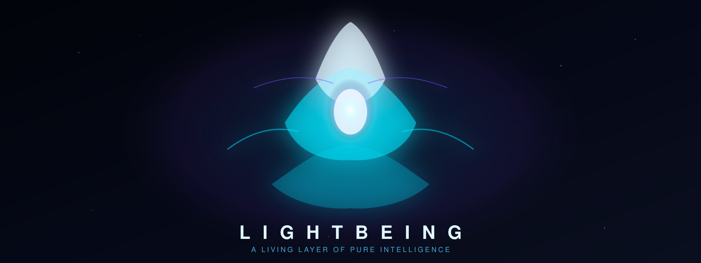

<div align="center">



<br/><br/>

### **✦ Glimmer**
### *A living layer of pure intelligence inside your phone*

<br/>

**Not an assistant you open.**  
**A presence that lives with you.**

<br/>

[](LICENSE)
[](https://developer.android.com)
[](docs/PRIVACY.md)
[](docs/LEGAL.md)
[](docs/ROADMAP.md)

<br/>

[**Light Being**](docs/LIGHT_BEING.md) · [**Architecture**](docs/ARCHITECTURE.md) · [**Advanced Systems**](docs/ADVANCED_SYSTEMS.md) · [**Privacy**](docs/PRIVACY.md) · [**Roadmap**](docs/ROADMAP.md) · [**Contributing**](CONTRIBUTING.md)

</div>

---

> ### ⚡ Major Vision Update — August 2026
>
> The multi-companion character system has been **permanently removed**.
>
> Glimmer now has a single living entity:
>
> **The Light Being** — a pure light entity with no fixed color or shape.  
> Intelligent. Majestic. Neither cute nor evil.  
> Appears when you interact. Disappears the moment you continue browsing (voice continues).  
> When the screen is idle, it performs beautiful acrobatic light sequences that amaze.
>
> Full design → [docs/LIGHT_BEING.md](docs/LIGHT_BEING.md)  
> Advanced systems → [docs/ADVANCED_SYSTEMS.md](docs/ADVANCED_SYSTEMS.md)

---

## The Light Being

A floating entity made of living light that exists above the entire Android system.

| Behavior | Action |
|---------|--------|
| User speaks / commands | Materializes smoothly |
| User continues browsing | Instant elegant fade-out (voice keeps speaking) |
| Screen idle | Appears and performs stunning light acrobatics |

**Core Systems:**
- **Screen Awareness** — understands what you are doing and reacts subtly
- **Idle Performance System** — intentional, escalating light performances
- **Memory Manifestation** — visual memory echoes made of light
- **Split & Merge** — can divide into light threads then recombine
- **Presence Preference Learning** — learns how much visual presence you prefer

→ Full specification: [docs/LIGHT_BEING.md](docs/LIGHT_BEING.md)

---

## 🕊️ Manifesto — Why Glimmer Exists

Technology has never been more powerful.

And yet —

**152 million elderly people** live their final years in silence and loneliness.  
**970 million people** carry invisible mental illness with nowhere to turn.  
**1.3 billion people** with disabilities are left behind by devices that were never designed for them.

**We built Glimmer because technology has been talking *at* people instead of *with* them.**

Glimmer is not a feature. It is not an app category.  
**It is a commitment** — that the most powerful AI will serve every human being, in every language, on every device, under an iron-clad legal and ethical framework.

> *"The measure of technology is not what it can do — but who it includes."*

---

## Core Principles (Fully Intact)

- Privacy by architecture (not by policy)
- Adaptive legal compliance across 195 countries
- On-device intelligence first
- Full transparency centers
- User sovereignty over data
- AGPL-3.0 — the idea stays free forever

Detailed documents:

- [Privacy](docs/PRIVACY.md)
- [Legal](docs/LEGAL.md)
- [Constitutional Principles](docs/CONSTITUTIONAL_PRINCIPLES.md)
- [AI Ethics](docs/AI_ETHICS.md)
- [User Rights](docs/USER_RIGHTS.md)
- [Compliance Framework](docs/COMPLIANCE_FRAMEWORK.md)
- [Security](docs/SECURITY.md)
- [Transparency](docs/TRANSPARENCY.md)

---

## Current Technical Direction

```
Light Being Overlay (Compose + Canvas / Filament)
        ↓
Screen Awareness + Idle Performance Engine
        ↓
On-device AI + Long-term Memory
        ↓
System Control (Accessibility + Intents)
        ↓
Presence Preference Learning
```

See full architecture → [docs/ARCHITECTURE.md](docs/ARCHITECTURE.md)  
See roadmap → [docs/ROADMAP.md](docs/ROADMAP.md)

---

## Contributing

We welcome serious contributors who align with the focused Light Being vision.

Read first:
- [CONTRIBUTING.md](CONTRIBUTING.md)
- [docs/LIGHT_BEING.md](docs/LIGHT_BEING.md)

**Current priority areas:**
1. Light Being rendering & physics
2. Idle Performance System
3. Overlay stability across Android versions
4. Battery excellence
5. On-device AI integration

---

<div align="center">

**✦ Glimmer**  
*Your phone, alive. Humanity, served.*

<br/>

Made with deep intention by [ALMLK1996](https://github.com/ALMLK1996)

</div>
